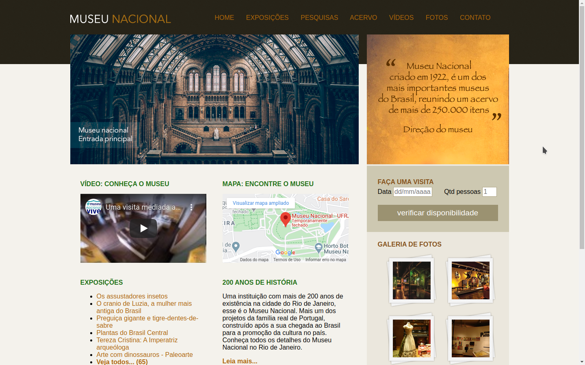

# Museu-Nacional
A website built with HTML and CSS

This websit was built using new tags html like aside, footer, header, nav, etc and many techniques of style CSS 3 like margin, padding, float, background with images and other.

https://museu-nacional.netlify.app/

